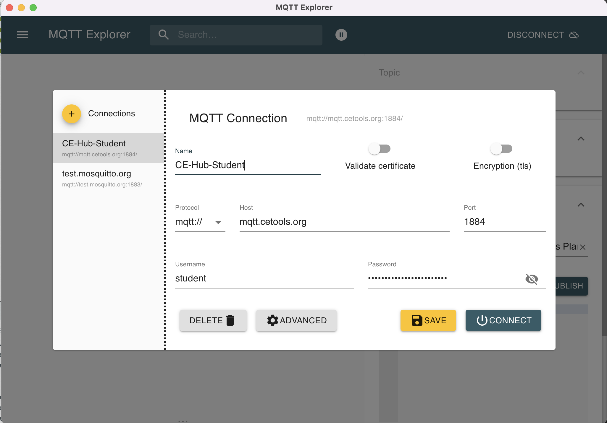
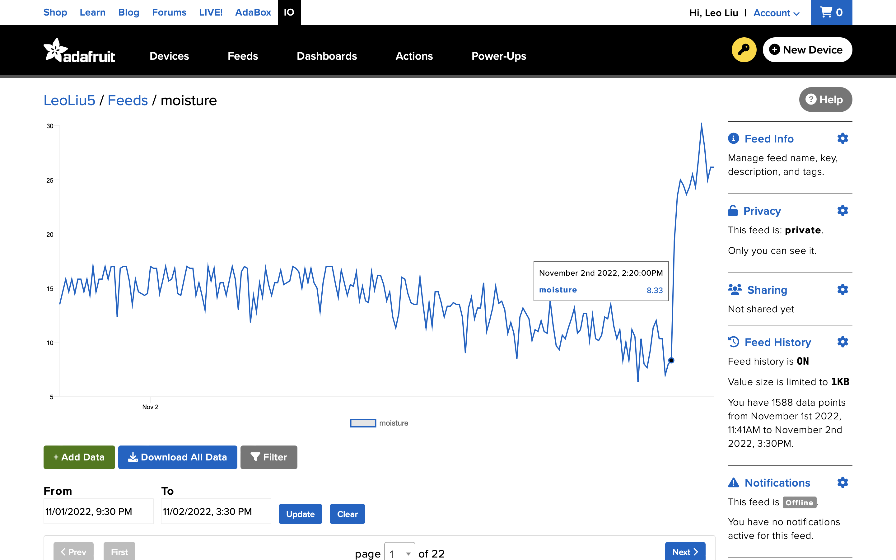

# CASA0014-Plant Monitor-Assessment by Leo Liu 


## Everybody's plant monitor is unique in its way.<br><br>


> ## Project Objective 
> <br> The purpose of this project is to provide the reader with a worked-out example of how to build your plant monitoring system. Through this project, the reader will be exposed to two completely different data flowing and displaying methods. By the end of this documentation, the reader will have enough information to decide between two data processing methods. 
if they want to use theCASA MQTT server, stored in InfluxDB and visualized on Grafana.
Feather Huzzah ESP8266 Wifi
getting familiar with MQTT and data flowing across the web


## - Main Hardware Components


- ### [A DHT22 temperature/humidity sensor](https://thepihut.com/products/dht22-temperature-humidity-sensor-extras?variant=27740418129&currency=GBP&utm_medium=product_sync&utm_source=google&utm_content=sag_organic&utm_campaign=sag_organic&gclid=CjwKCAjwtp2bBhAGEiwAOZZTuF0XQfJresicn_DwyArRHfgDXQoU8I8vx1WCKW8TAyW2_viN2bb0choC5kcQAvD_BwE) and a pair of nails. 
- ### A CASA Plant Monitor shield board designed specifically for this project by [Duncan](https://github.com/djdunc) from the CASA teaching team. for the packaging purpose.
- ### [A Feather Huzzah ESP8266](https://www.adafruit.com/product/2821), which can be used as a microcontroller through Wi-Fi communication.
- ### [A Micro Servo Motor SG90](https://thepihut.com/products/towerpro-servo-motor-sg90-hv-continuous-rotation?variant=32313097584702&currency=GBP&utm_medium=product_sync&utm_source=google&utm_content=sag_organic&utm_campaign=sag_organic&gclid=Cj0KCQjw7KqZBhCBARIsAI-fTKI-at3NhpNijTn3ZE_aV5rWxfhLGcBbQC2OxSFwUD651NbvcVpOyggaAg0dEALw_wcB), which can rotate 180 degrees.
- ### [Two Wago 5-way lever connectors](https://www.tlc-direct.co.uk/Products/WA415C.html?source=adwords&ad_position=&ad_id=&placement=&kw=&network=x&matchtype=&ad_type=pla&product_id=WA415C&product_partition_id=&campaign=shopping_cable_accessories&version=finalurl_v3&gclid=CjwKCAjwtp2bBhAGEiwAOZZTuK6tVA2OvYFV9tns6OoE_1E5pF4wASJ566F2nNVo0v9WS7h3xm6Y7RoC9bMQAvD_BwE). They are perfect for increasing the number of power ports in the boards.
- ### [A Raspberry Pi](https://thepihut.com/products/raspberry-pi-4-model-b), which can be used as a data store and upload the data to the CASA MQTT server. 

<br>

# - Hardware Components Assembling
1. Prepare two 5cm steel nails and two 15cm single cable wires. Connect each wire to each nail, then use a soldering iron to apply plastic welding around the connecting point between the wire and the nail. Make sure the ends of the wires are embedded under the plastic to prevent corrosion or unstable wires. We will later put both nails into the soil to detect the moisture level. The logic behind using nails is that water can conduct electricity but dry soil can not. As the water content increases, the resistance between the nails decrease (Jin, 2020).


Next, we will use the packaging piece, which was 3D printed by [Dhruv](https://github.com/drvkmr), to hold our nails and wires. Put the nails through the holes located at both ends and arrange the wires in your way. Then use a soldering iron to apply more plastic welding around the connecting point between the nail and the hole to fix the nail's position.


2. Take out the CASA Plant Monitor shield board and start soldering the DHT22 sensors and the resistors to the board:


Flip the board over and start soldering male header pins to the board. We will be using the 3v, GND, A0, D12, and D13 pins from the board. Then push the little green piece, a Nylon PCB Terminal Block, onto the pre-reserved pins on the board. Be careful not to use too much strength and break the board. The Nylon PCB Terminal Block can be used as a quick and simple electrical connection method, which provides a stable connection point for one or more wires together. Use a terminal block screwdriver to connect the wires from the nails to the Nylon PCB Terminal Block, the order of the wires does not matter in this case. 


Therefore, the electricity can be sent to the soil through one of the wires first, then the other wire will be responsible for detecting the electricity level. Overall, a high moisture level in the soil represents a better ability in conducting electricity (Jin, 2020).


3. Take out the Feather Huzzah ESP8266 board and start soldering female header pins to the board:


We will need to connect the following pins from the Feather board to the CASA shield board using 7 colourful male-to-female jumper wires:
- Feather ADC to A0 of the CASA shield board
- Feather 13/MOSI to D13 of the CASA shield board
- Feather 12/MISO to D12 of the CASA shield board
Before connecting more pins, we need to solve the problem that there is only one GND pin and one 3V pin in the Feather board. If we directly connect the GND pin and the 3V pin to the CASA shield board, then there will be no GND pin or 3V pin reserved for the servo motor. Fortunately, we can connect two lever connectors to the Feather board to increase the number of GND pins and the 3V pins.
- Feather GND to one of the 5 lever connectors
- Feather 3V to the other 5 lever connectors


- CASA shield GND to the 5 lever connectors connected to Feather GND
- CASA shield 3V to the 5 lever connectors connected to Feather 3V


4. We will need to connect the following pins from the Feather board to the Micro Servo Motor SG90 using 3 colourful male-to-male jumper wires:
- The brown servo motor wire to the 5 lever connectors connected to Feather GND
- The red servo motor wire to the 5 lever connectors connected to Feather 3V 
- The orange servo motor wire to Feather Pin 2


In terms of waterproofing and making sure the hardware parts can run continuously for 9 months, we will use the plastic protector, which was 3D printed by [Dhruv](https://github.com/drvkmr), to wrap up the components. Use the soldering iron to make melt small holes in the plastic so the jumping wires can connect through the protector. Make sure to test your plant monitor before putting on the plastic protectors, otherwise, it will take more time and effort to take everything apart if something is not assembled correctly. 


# - Through this project, I have tried two completely different data uploading and displaying methods. The first one is based on the procedures and the sample codes from the workshop provided by [Duncan](https://github.com/djdunc) :
1. The programming software we are going to use throughout this project is the Arduino IDE. Start by installing the CP2104 driver from [this official guide](https://learn.adafruit.com/adafruit-feather-huzzah-esp8266/using-arduino-ide) on the Arduino IDE. Then go to preferences and paste the URL http://arduino.esp8266.com/stable/package_esp8266com_index.json into the "Additional Board Manager URLs" space. 


Install the latest version of the ESP8266 package in "Board Manager" and open the [mqtt_temp_mois_humi.ino](https://github.com/LeoLiu5/plantmonitor/blob/main/Upload%20data%20to%20mqtt%20(the%20wrokshop)/mqtt_temp_mois_humi.ino file in the Arduino IDE. 


Open "Library Manager", and start installing the following libraries so we can include them in our Arduino file:

   

In [mqtt_temp_mois_humi.ino](https://github.com/LeoLiu5/plantmonitor/blob/main/mqtt_temp_mois_humi/mqtt_temp_mois_humi.ino), this command 

```
#include
``` 

includes the libraries or files needed for the sketch. We also need to declare some sensor variables, pin numbers, and the variables required for setting up Wifi and MQTT connections:

``` 
// pin used to control the servo
#define SERVO_PIN 2
// create an instance of the servo class
Servo servo;

#define DHTTYPE DHT22   // DHT 22  (AM2302), AM2321

// Sensors - DHT22 and Nails
uint8_t DHTPin = 12;        // on Pin 2 of the Huzzah
uint8_t soilPin = 0;      // ADC or A0 pin on Huzzah

float Temperature;
float Humidity;
int Moisture = 1; // initial value just in case web page is loaded before readMoisture called
int sensorVCC = 13;
int blueLED = 2;
DHT dht(DHTPin, DHTTYPE);   // Initialize DHT sensor.

// Wifi and MQTT
#include "arduino_secrets.h" 
/*
**** please enter your sensitive data in the Secret tab/arduino_secrets.h
**** using format below

#define SECRET_SSID "ssid name"
#define SECRET_PASS "ssid password"
#define SECRET_MQTTUSER "user name - eg student"
#define SECRET_MQTTPASS "password";
 */

const char* ssid     = SECRET_SSID;
const char* password = SECRET_PASS;
const char* mqttuser = SECRET_MQTTUSER;
const char* mqttpass = SECRET_MQTTPASS;

ESP8266WebServer server(80);
const char* mqtt_server = "mqtt.cetools.org";
WiFiClient espClient;
PubSubClient client(espClient);
long lastMsg = 0;
char msg[50];
int value = 0;

// Date and time
Timezone GB;

``` 
We need to fill [arduino_secrets.h](https://github.com/LeoLiu5/plantmonitor/blob/main/mqtt_temp_mois_humi/arduino_secrets.h) to define the variables required for setting up Wifi and MQTT connections as well:

``` 
#define SECRET_SSID "CE-Hub-Student"
#define SECRET_PASS ""
#define SECRET_MQTTUSER "student"
#define SECRET_MQTTPASS ""
``` 

In setup(), we need to declare the blue LED for status indicator, create a Serial connection for debugging, use pinMode() to initialize the DHT sensor and the servo motor, and initialize the wifi and the MQTT server:

``` 
void setup() {
  // Set up LED to be controllable via broker
  // Initialize the BUILTIN_LED pin as an output
  // Turn the LED off by making the voltage HIGH
  pinMode(BUILTIN_LED, OUTPUT);     
  digitalWrite(BUILTIN_LED, HIGH);  

  // Set up the outputs to control the soil sensor
  // switch and the blue LED for status indicator
  pinMode(sensorVCC, OUTPUT); 
  digitalWrite(sensorVCC, LOW);
  pinMode(blueLED, OUTPUT); 
  digitalWrite(blueLED, HIGH);

  // open serial connection for debug info
  Serial.begin(115200);
  delay(100);
  // tell the servo class which pin we are using
  servo.attach(SERVO_PIN);

  // initialize servo
  pinMode(SERVO_PIN, OUTPUT);
  // start DHT22 sensor
  pinMode(DHTPin, INPUT);
  dht.begin();

  // run initialisation functions
  startWifi();
  startWebserver();
  syncDate();

  // start MQTT server
  client.setServer(mqtt_server, 1884);
  client.setCallback(callback);

}
```

In loop(), we need to check the handler for the webserver to see if anyone is requesting a webpage. We can change minuteChanged() to secondChanged() (both functions are included in <ezTime.h>) to change the frequency of data reading and data uploading to the MQTT server:

``` 
void loop() {
  // handler for receiving requests to webserver
  server.handleClient();

  if (minuteChanged()) {
    readMoisture();
    sendMQTT();
    Serial.println(GB.dateTime("H:i:s")); // UTC.dateTime("l, d-M-y H:i:s.v T")

    
  }
  // Testing if the servo working
  // tell servo to go to a particular angle
    // servo.write(0);  
    // delay(1000);
  
    // servo.write(90);              
    // delay(500); 
  
    // servo.write(135);              
    // delay(500);
  
    // servo.write(180);              
    // delay(1500);
  client.loop();
}

``` 
In the rest of [mqtt_temp_mois_humi.ino](https://github.com/LeoLiu5/plantmonitor/blob/main/mqtt_temp_mois_humi/mqtt_temp_mois_humi.ino), we need to create several functions to complete the codes. 
ReadMoisture() turns on the soil sensor using the NPN BC547 as a digital switch, so one of the nails can send voltage through the soil and the other nail can measure the [resistance](https://en.wikipedia.org/wiki/Electrical_resistance_and_conductance). StartWifi() initializes the wifi and StartWebserver() initializes the webserver. 
The Arduino has a concept of time but it is based upon the number of milliseconds since the board started. Therefore,it is better to use SyncDate() function to set the time on the device from an NTP server on the internet and define the time for applications. It is important to record the date or time when a measurement was taken.
SendMQTT() reconnects to the MQTT broker if it isn't already connected, check to see if there are any messages inbound, read sensors, and update data. I also added a new feature that allow sthe servo motor to spin if the plant needs some water or the environment is not sutible for growing.
Callback() executes codes when a message is received from the MQTT server for any topics subscribed using client.subscribe(), and reconnect() creates a connection to the MQTT server while defining any subscribed topics.
Finally, include the functions associated with the webserver: handle_OnConnect(), handle_NotFound(), and SendHTML():

``` 
void readMoisture(){
  // power the sensor
  digitalWrite(sensorVCC, HIGH);
  digitalWrite(blueLED, LOW);
  delay(100);
  // read the value from the sensor:
  Moisture = analogRead(soilPin);         
  //Moisture = map(analogRead(soilPin), 0,320, 0, 100);    // note: if mapping work out max value by dipping in water     
  //stop power
  digitalWrite(sensorVCC, LOW);  
  digitalWrite(blueLED, HIGH);
  delay(100);
  Serial.print("Wet ");
  Serial.println(Moisture);   // read the value from the nails
}
void startWifi() {
  // We start by connecting to a WiFi network
  Serial.println();
  Serial.print("Connecting to ");
  Serial.println(ssid);
  WiFi.begin(ssid, password);

  // check to see if connected and wait until you are
  while (WiFi.status() != WL_CONNECTED) {
    delay(500);
    Serial.print(".");
  }
  Serial.println("");
  Serial.println("WiFi connected");
  Serial.print("IP address: ");
  Serial.println(WiFi.localIP());
}

void syncDate() {
  // get real date and time
  waitForSync();
  Serial.println("UTC: " + UTC.dateTime());
  GB.setLocation("Europe/London");
  Serial.println("London time: " + GB.dateTime());
}
void startWebserver() {
  // when connected and IP address obtained start HTTP server
  server.on("/", handle_OnConnect);
  server.onNotFound(handle_NotFound);
  server.begin();
  Serial.println("HTTP server started");
}
void sendMQTT() {

  if (!client.connected()) {
    reconnect();
  }
  client.loop();

  Temperature = dht.readTemperature(); // Gets the values of the temperature
  snprintf (msg, 50, "%.1f", Temperature);
  Serial.print("Publish message for t: ");
  Serial.println(msg);
  client.publish("student/CASA0014/plant/Leo's Anonymous Plant/temperature", msg);

  Humidity = dht.readHumidity(); // Gets the values of the humidity
  snprintf (msg, 50, "%.0f", Humidity);
  Serial.print("Publish message for h: ");
  Serial.println(msg);
  client.publish("student/CASA0014/plant/Leo's Anonymous Plant/humidity", msg);

  //Moisture = analogRead(soilPin);   // moisture read by readMoisture function
  snprintf (msg, 50, "%.0i", Moisture);
  Serial.print("Publish message for m: ");
  Serial.println(msg);
  client.publish("student/CASA0014/plant/Leo's Anonymous Plant/moisture", msg);
// The servo motor will start to move if one of the below conditions is met:
    if (Humidity<50 || Moisture<20 || Temperature<18 || Temperature>28){  
    servo.write(0);  // tell servo to go to a particular angle
    delay(1000);
  
    servo.write(90);              
    delay(500); 
  
    servo.write(135);              
    delay(500);
  
    servo.write(180);              
    delay(1500);}
}
void callback(char* topic, byte* payload, unsigned int length) {
  Serial.print("Message arrived [");
  Serial.print(topic);
  Serial.print("] ");
  for (int i = 0; i < length; i++) {
    Serial.print((char)payload[i]);
  }
  Serial.println();

  // Switch on the LED if an 1 was received as first character
  if ((char)payload[0] == '1') {
    digitalWrite(BUILTIN_LED, LOW);   // Turn the LED on (Note that LOW is the voltage level
    // but actually the LED is on; this is because it is active low on the ESP-01)
  } else {
    digitalWrite(BUILTIN_LED, HIGH);  // Turn the LED off by making the voltage HIGH
  }

}
void reconnect() {
  // Loop until we're reconnected
  while (!client.connected()) {
    Serial.print("Attempting MQTT connection...");
    // Create a random client ID
    String clientId = "ESP8266Client-";
    clientId += String(random(0xffff), HEX);
    
    // Attempt to connect with clientID, username and password
    if (client.connect(clientId.c_str(), mqttuser, mqttpass)) {
      Serial.println("connected");
      // ... and resubscribe
      client.subscribe("student/CASA0014/plant/Leo's Anonymous Plant/inTopic");
    } else {
      Serial.print("failed, rc=");
      Serial.print(client.state());
      Serial.println(" try again in 5 seconds");
      // Wait 5 seconds before retrying
      delay(5000);
    }
  }
}
void handle_OnConnect() {
  Temperature = dht.readTemperature(); // Gets the values of the temperature
  Humidity = dht.readHumidity(); // Gets the values of the humidity
  server.send(200, "text/html", SendHTML(Temperature, Humidity, Moisture));
}

void handle_NotFound() {
  server.send(404, "text/plain", "Not found");
}

String SendHTML(float Temperaturestat, float Humiditystat, int Moisturestat) {
  String ptr = "<!DOCTYPE html> <html>\n";
  ptr += "<head><meta name=\"viewport\" content=\"width=device-width, initial-scale=1.0, user-scalable=no\">\n";
  ptr += "<title>ESP8266 DHT22 Report</title>\n";
  ptr += "<style>html { font-family: Helvetica; display: inline-block; margin: 0px auto; text-align: center;}\n";
  ptr += "body{margin-top: 50px;} h1 {color: #444444;margin: 50px auto 30px;}\n";
  ptr += "p {font-size: 24px;color: #444444;margin-bottom: 10px;}\n";
  ptr += "</style>\n";
  ptr += "</head>\n";
  ptr += "<body>\n";
  ptr += "<div id=\"webpage\">\n";
  ptr += "<h1>ESP8266 Huzzah DHT22 Report</h1>\n";

  ptr += "<p>Temperature: ";
  ptr += (int)Temperaturestat;
  ptr += " C</p>";
  ptr += "<p>Humidity: ";
  ptr += (int)Humiditystat;
  ptr += "%</p>";
  ptr += "<p>Moisture: ";
  ptr += Moisturestat;
  ptr += "</p>";
  ptr += "<p>Sampled on: ";
  ptr += GB.dateTime("l,");
  ptr += "<br>";
  ptr += GB.dateTime("d-M-y H:i:s T");
  ptr += "</p>";

  ptr += "</div>\n";
  ptr += "</body>\n";
  ptr += "</html>\n";
  return ptr;
}
``` 
Now, we should have a working Feather board which is able to send readings to the MQTT webserver and visible locally by browsing to the IP address of the device:

 

2. Before setting up the Raspberry Pi to our datastore, we need to install [the latest 64bit version of Raspbian](https://www.raspberrypi.com/software/). After the installation, insert a microSD card and make sure there is at least 8GB or larger space. Before start writing on your SD card, choose the 64-bit operating system, then input your local network information and set up your account. Record your information since we will be using them in a miniute. For setting up a headless device when you can plug it into a network where you don't know which IP address will be assigned, check this [guide](https://www.tomshardware.com/reviews/raspberry-pi-headless-setup-how-to,6028.html):


After finishing writing and the card flashed, insert the card into your Raspberry Pi and power it up. Open up a new Terminal window on your Mac and enter the hostname you just created:


In the Terminal window, install InfluxDB with the Ubuntu & Debian (Arm 64-bit) platform by entering the commands from [the official website](https://portal.influxdata.com/downloads/#influxdb) and [the official guide](https://docs.influxdata.com/influxdb/v2.4/install/?t=Raspberry+Pi):


After the setup, input your hostname into the link http://hostname.local:8086 and create a new account. 


Go to Settings -> Templates, insert this link https://github.com/influxdata/community-templates/blob/master/raspberry-pi/raspberry-pi-system.yml to create a Raspberry Pi template for the data:


In the Terminal window, install and set up Telegraf 1.24 by entering the following commands line by line (use the ifconfig command to find your IP address):
``` 
sudo apt-get update && sudo apt-get install telegraf -y
export INFLUX_HOST=http:// your IP address:8086
export INFLUX_ORG=casa0014
export INFLUX_TOKEN=---you-will-have-your-own-token-here---
telegraf --config http:// your IP address:8086/api/v2/telegrafs/0a2093eea36cb000
``` 

 

Edit the default configuration file on your Raspberry Pi. There are many [configuration options](https://docs.influxdata.com/telegraf/v1.24/configuration/). Here is [an example configuration file]() I have used. In the Terminal window, update the default configuration file using the following commands:
``` 
sudo mv /etc/telegraf/telegraf.conf /etc/telegraf/telegraf-original.conf
sudo nano /etc/telegraf/telegraf.conf
sudo systemctl stop influxdb
sudo systemctl start influxdb
sudo systemctl status influxdb
sudo systemctl stop telegraf
sudo systemctl start telegraf
sudo systemctl status telegraf
``` 
Now, you can check out the data in Data Explorer:


3. In the Terminal window, install and set up Grafana by entering the following commands line by line:

``` 
sudo apt-get install -y adduser libfontconfig1
wget https://dl.grafana.com/enterprise/release/grafana-enterprise_9.2.0_arm64.deb
sudo dpkg -i grafana-enterprise_9.2.0_arm64.deb
sudo /bin/systemctl daemon-reload
sudo /bin/systemctl enable grafana-server
sudo /bin/systemctl start grafana-server
``` 
Now go to http://staff-pi-casa0014.local:3000 and log in use the account "admin" and the password "admin".


Add your first datasource and change some settings:


create a dashboard and in the dashboard, create a panel to display the temperature reading:


In the same dashboard, create a panel for the humidity reading and create another for the moisture reading.

 

# - Another method of uplodaing and displaying the readings is using the **Adafruit IO system**. The **Adafruit IO system** doesn't need the Raspberry Pi, the MQTT server, Influxdb, or Grafana. **The system** has its own dashboards for displaying data and can receive readings directly from the Feather board:

1. Open [the Ariduino sketch](https://github.com/LeoLiu5/plantmonitor/blob/main/adafruitio/completed%20codes/completed%20codes.ino) prepared for Adafruit IO and [the configuration file](https://github.com/LeoLiu5/plantmonitor/blob/main/adafruitio/completed%20codes/config.h). In addition to the libraries we have installed in the previous section, we need the Adafruit Unified Sensor library as well:

  

[The Adafruit IO sketch](https://github.com/LeoLiu5/plantmonitor/blob/main/adafruitio/completed%20codes/completed%20codes.ino) has a similar structure to [the workshop sample sketch](https://github.com/LeoLiu5/plantmonitor/blob/main/Upload%20data%20to%20mqtt%20(the%20wrokshop)/mqtt_temp_mois_humi.ino). 
It is a combination of [the Adafruit IO Servo Example](https://github.com/LeoLiu5/plantmonitor/blob/main/adafruitio/adafruitio%20sample%20codes/adafruitio_16_servo.ino) and [the Adafruit IO Temperature & Humidity Example](https://github.com/LeoLiu5/plantmonitor/blob/main/adafruitio/adafruitio%20sample%20codes/adafruitio_15_temp_humidity.ino) both retrieved from the Adafruit IO Arduino library. The library includes many usefl example files designed for various functions. Those examples serve as templates to help beginners, such as me, to initiate a project and provide opportunities to learn. 

  

Since we are using Adafruit IO instead of MQTT and Grafana to display our data, we need to upload our data to Feeds in Adafruit IO:
``` 
// set up the 'temperature' and 'humidity' feeds
// set up the 'servo' feed
// set up the 'moisture' feed
AdafruitIO_Feed *servo_feed = io.feed("servo");
AdafruitIO_Feed *temperature = io.feed("temperature");
AdafruitIO_Feed *humidity = io.feed("humidity");
AdafruitIO_Feed *moisture = io.feed("moisture");
``` 
Another thing I have modified is the frequency of sending the data: 
``` 
unsigned long previousMillis = 0UL;
unsigned long interval = 1800000UL; // (1000 (ms) = 1 second; interval = 30 mins)
...
unsigned long currentMillis = millis();

  if(currentMillis - previousMillis > interval)
  {
	/* The Arduino executes this code once every 30 mins
 	*  (1000 (ms) = 1 second; interval = 30 mins)
 	*/
  TempHumMoi(); // save temperature, humidity, moisture to Adafruit IO
 	// Don't forget to update the previousMillis value
 	previousMillis = currentMillis;

// save temperature, humidity, moisture to Adafruit IO
``` 
I have changed the frequency of saving readings to Adafruit IO from per minute using minuteChange() to per 30 minutes using (currentMillis - previousMillis > interval).

After compiling [the sketch](https://github.com/LeoLiu5/plantmonitor/blob/main/adafruitio/completed%20codes/completed%20codes.ino), we can check the feeds. In Adafruit IO, Feeds not only hold our readings, but also record the meta-data (date, time, and GPS coordinates):

  

I left my plant monitor operating overnight in the CASA office from 11/01/2022, 9:30 PM to 11/02/2022, 3:30 PM for 18 hours stright:


From the temperature feed, we can see the temperature slowly drops to the lowest point (20.02°C) during the night until 6 am. Then the temperature slowly goes up during the morning and suddenly increases around 10 am when the lecture starts. [The heat generated by the human body for homeostasis disperses throughout the body, and in turn heats up the air surrounding the body.](https://courses.lumenlearning.com/suny-ap2/chapter/energy-and-heat-balance/) At 11:30 am, the temperature reaches its peak (24.45°C). Then, the temperature slowly drops to around 21°C by 3:30pm when people start leaving the room:


[Humidity is a measurement of the amount of water vapour in the air and is usually presented in percentage.](https://www.metoffice.gov.uk/weather/learn-about/weather/types-of-weather/humidity) 
From the humidity feed, we can see the humidity has been relativly stable (range from 47% to 49%) overnight utill 9:50am, right before the lecture starts. Then the humidity rapidly increases and reaches its peak (62.72%) at 1:50pm. Then the humidity drops to around 21°C by 3:30pm. Overall, the humidity follows a similar trend as the temperature. [There are evidence indicating that the more animals, people or plants are in a room, the more the humidity increases.](https://www.swissflex.com/en/blog/humidity-in-your-bedroom)



From the moisture feed, it is obvious that the moisture readings are not as precise or accurate as the temperature or humidity readings. On the moisture graph, there are lots of unexpected up and down patterns, which cannot be observed from either the temperature or the humidity graph. After comparing my results with other students, I have found that the others have the same issue and not getting stable readings. Therefore, I could rule out the possibility that my prototype or codes are not correct.
I suspect an explanation behind this phenomenon is because the DHT22 sensor is more advanced, which can provide more reliable results than two nails connected with wires could. 
Overall, the moisture in the soil does not seem to have any connections with the number of people in a room. The sudden increase at 2:20pm is beacuse the plant was being watered.
Unlike the temperature or the humidity feed, we have to calibrate the moisture feed to interpret the readings. I have seen severl different ways done by my peers: [Lionel-Lim](https://github.com/Lionel-Lim/plantMonitor) used [Tanh estimators (the hyperbolic tangent function)](https://reference.wolfram.com/language/ref/Tanh.html), which is an efficient normalization technique; [heyhaiden](https://github.com/heyhaiden/plantMonitor) recalculated the range of the moisture readings to 1 ~ 100 for easier graphical representation. I made a similar apporach to [heyhaiden](https://github.com/heyhaiden/plantMonitor)'s calibration method:


I tested the maximum moisture reading by putting both nails fully into the water and got a reading of 117.33.


After drying both nails, I tested the minimum moisture reading by holding both nails in the air and got a reading of 4.57.
[There are evidence stating that the majority of plants thrive in soil with a moisture level that ranges between 20% and 60%.](https://www.greenwaybiotech.com/blogs/gardening-articles/how-soil-moisture-affects-your-plants-growth) Therefore, I used the reading 0.2*117.33 ≈ 24 as a threshhold indicator that the plant requires watering in the Arduino files. Overall, the moisture feed has a unique overall trend from either the temperature feed or the humidity feed.


## - References

- "Adafruit IO Basics: Temperature & Humidity" by Todd Treece: <br> https://learn.adafruit.com/adafruit-io-basics-temperature-and-humidity/arduino-wiring
- "Adafruit IO Basics: Servo" by Todd Treece: <br> https://learn.adafruit.com/adafruit-io-basics-servo/wiring
- "A Beginner's Guide to the ESP8266" by Pieter P: <br> https://tttapa.github.io/ESP8266/Chap07%20-%20Wi-Fi%20Connections.html
- "Energy and Heat Balance" by Lumen Learning: <br> https://courses.lumenlearning.com/suny-ap2/chapter/energy-and-heat-balance/
- "Humidity" by Met Office:  <br> https://www.metoffice.gov.uk/weather/learn-about/weather/types-of-weather/humidity
- "How to regulate the humidity in your bedroom" by Swissflex: <br> https://www.swissflex.com/en/blog/humidity-in-your-bedroom
- "Tanh" by Wolfram. <br> https://reference.wolfram.com/language/ref/Tanh.html
- "How Soil Moisture Can Affect Your Plant's Growth" by Amir Tajer: <br> https://www.greenwaybiotech.com/blogs/gardening-articles/how-soil-moisture-affects-your-plants-growth
<br>


### 